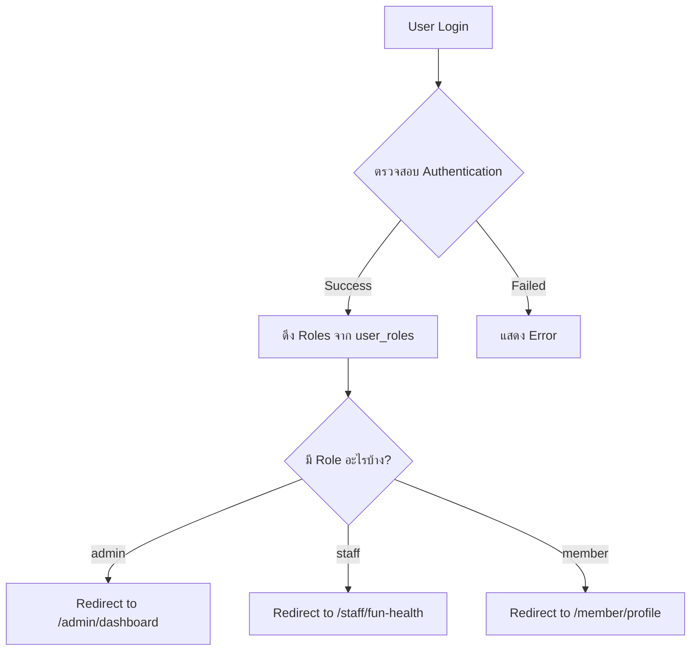

# Role-Based Access Control System (RBAC)
## ระบบควบคุมการเข้าถึงตามบทบาท

## 🎯 ภาพรวมระบบ

FUN Platform ใช้ระบบ **Role-Based Access Control (RBAC)** ในการจัดการสิทธิ์การเข้าถึงของผู้ใช้ โดยแบ่งผู้ใช้ออกเป็น 3 บทบาทหลัก:

### 1. **Member** (สมาชิก)
- ผู้สูงอายุและผู้ดูแล
- เข้าถึง Member Portal
- จัดการข้อมูลส่วนตัว, กิจกรรม, ทริป

### 2. **Staff** (พนักงาน)
- พนักงานปฏิบัติงาน
- เข้าถึง Staff Pages
- จัดการกิจกรรม, ทริป, ข้อมูลสุขภาพ

### 3. **Admin** (ผู้ดูแลระบบ)
- ผู้ดูแลระบบทั้งหมด
- เข้าถึง Admin Dashboard
- จัดการพนักงาน, การเงิน, ตั้งค่าระบบ

---

## 🔐 โครงสร้างฐานข้อมูล

### ตาราง `user_roles`
```sql
CREATE TABLE public.user_roles (
    id UUID PRIMARY KEY DEFAULT gen_random_uuid(),
    user_id UUID NOT NULL REFERENCES auth.users(id) ON DELETE CASCADE,
    role app_role NOT NULL,
    created_at TIMESTAMPTZ DEFAULT NOW(),
    UNIQUE (user_id, role)
);
```

### Enum `app_role`
```sql
CREATE TYPE public.app_role AS ENUM ('admin', 'staff', 'member');
```

**สำคัญ:** ผู้ใช้หนึ่งคนสามารถมีได้หลาย roles พร้อมกัน เช่น Admin + Staff + Member

---

## 🛡️ Row Level Security (RLS)

### การทำงานของ RLS
RLS คือระบบรักษาความปลอดภัยระดับแถว (Row-Level Security) ที่ควบคุมว่าผู้ใช้แต่ละคนสามารถเห็น/แก้ไขข้อมูลแถวไหนได้บ้าง

### ตัวอย่าง Policy บน `user_roles`

```sql
-- ผู้ใช้เห็นได้เฉพาะ roles ของตัวเอง
CREATE POLICY "Users can view their own roles"
ON public.user_roles
FOR SELECT
TO authenticated
USING (auth.uid() = user_id);

-- เฉพาะ Admin ถึงจะเห็น roles ของคนอื่นได้
CREATE POLICY "Admins can view all roles"
ON public.user_roles
FOR SELECT
TO authenticated
USING (public.has_role(auth.uid(), 'admin'));
```

### Security Definer Function
เพื่อป้องกัน infinite recursion ในการเช็ค role:

```sql
CREATE OR REPLACE FUNCTION public.has_role(_user_id uuid, _role app_role)
RETURNS boolean
LANGUAGE sql
STABLE
SECURITY DEFINER
SET search_path = public
AS $$
  SELECT EXISTS (
    SELECT 1
    FROM public.user_roles
    WHERE user_id = _user_id AND role = _role
  )
$$;
```

---

## 🚦 การตรวจสอบสิทธิ์ในระบบ

### 1. **ฝั่ง Frontend (React)**

#### Protected Routes
```typescript
<ProtectedRoute requiredRole="admin">
  <AdminDashboard />
</ProtectedRoute>
```

#### Role Checking
```typescript
const { userRole, hasRole } = useAuth();

if (hasRole('admin')) {
  // แสดงเมนู Admin
}
```

#### Role Priority
หาก user มีหลาย roles ระบบจะเลือก priority สูงสุด:
```typescript
if (roles.includes('admin')) return 'admin';
if (roles.includes('staff')) return 'staff';
return 'member';
```

### 2. **ฝั่ง Backend (Supabase)**

#### RLS Policies
- **SELECT**: ใครเห็นข้อมูลอะไรได้บ้าง
- **INSERT**: ใครสร้างข้อมูลได้บ้าง
- **UPDATE**: ใครแก้ไขข้อมูลได้บ้าง
- **DELETE**: ใครลบข้อมูลได้บ้าง

#### ตัวอย่าง Policy สำหรับตารางอื่น
```sql
-- เฉพาะ Member เห็นข้อมูลของตัวเอง
CREATE POLICY "Members view own data"
ON public.member_trips
FOR SELECT
TO authenticated
USING (auth.uid() = user_id);

-- Staff เห็นข้อมูลทั้งหมด
CREATE POLICY "Staff view all trips"
ON public.member_trips
FOR SELECT
TO authenticated
USING (public.has_role(auth.uid(), 'staff'));
```

---

## 🌐 การทำงานในเว็บแอปพลิเคชัน

### Flow การ Login และ Redirect



### ตัวอย่างโค้ด Sign In
```typescript
const signIn = async (email: string, password: string) => {
  // 1. Login ด้วย Supabase Auth
  const { error } = await supabase.auth.signInWithPassword({
    email,
    password,
  });
  
  if (!error) {
    // 2. ดึง Roles ของ User
    const { data: roles } = await supabase
      .from('user_roles')
      .select('role')
      .eq('user_id', userId);
    
    // 3. Redirect ตาม Role
    const roleList = roles.map(r => r.role);
    if (roleList.includes('admin')) {
      navigate('/admin/dashboard');
    } else if (roleList.includes('staff')) {
      navigate('/staff/fun-health');
    } else {
      navigate('/member/profile');
    }
  }
};
```

---

## 🔍 ระบบจะรู้ได้อย่างไรว่า Login ไหนมีสิทธิ์อะไร?

### 1. **JWT Token**
เมื่อ user login สำเร็จ Supabase จะออก JWT (JSON Web Token) ที่มีข้อมูล:
- `user_id`: ID ของผู้ใช้
- `email`: อีเมลของผู้ใช้
- `role`: "authenticated" (สำหรับ Supabase Auth)

### 2. **Database Query กับ RLS**
เมื่อ frontend query ข้อมูล:
```typescript
const { data } = await supabase
  .from('user_roles')
  .select('role')
  .eq('user_id', userId);
```

Supabase จะ:
1. ตรวจสอบ JWT Token ว่า valid หรือไม่
2. ดึง `auth.uid()` จาก Token
3. รัน RLS Policy เพื่อกรองข้อมูลตาม Policy
4. Return เฉพาะข้อมูลที่ผ่าน RLS

### 3. **RLS Policy Protection**
ตัวอย่าง Policy ที่ป้องกันไม่ให้ user ธรรมดาเห็น roles ของคนอื่น:

```sql
-- ✅ User สามารถดู roles ของตัวเองเท่านั้น
USING (auth.uid() = user_id)

-- ✅ หรือเป็น Admin
USING (public.has_role(auth.uid(), 'admin'))
```

---

## 📊 ตัวอย่างสถานการณ์จริง

### สถานการณ์ 1: User ปกติพยายามดู Admin Page
```
1. User login → ได้ role = 'member'
2. User พยายาม access /admin/dashboard
3. ProtectedRoute เช็ค: userRole !== 'admin'
4. Redirect ไป /member/profile
```

### สถานการณ์ 2: Admin พยายามแก้ไข Role ของ Member
```
1. Admin query: UPDATE user_roles SET role = 'staff'
2. RLS ตรวจสอบ: has_role(auth.uid(), 'admin') = TRUE
3. ✅ อนุญาตให้แก้ไขได้
```

### สถานการณ์ 3: Member พยายามแก้ไข Role ของตัวเอง
```
1. Member query: INSERT INTO user_roles (role) VALUES ('admin')
2. RLS ตรวจสอบ: has_role(auth.uid(), 'admin') = FALSE
3. ❌ ปฏิเสธการแก้ไข (Permission Denied)
```

---

## 🎯 Best Practices

### 1. **ใช้ RLS ทุกตาราง**
```sql
ALTER TABLE public.your_table ENABLE ROW LEVEL SECURITY;
```

### 2. **ไม่เก็บ Role ใน localStorage**
❌ **อันตราย:** `localStorage.setItem('role', 'admin')` // ถูกแก้ไขได้ง่าย
✅ **ปลอดภัย:** Query จาก database ทุกครั้งและใช้ RLS

### 3. **ใช้ Security Definer Function**
ป้องกัน infinite recursion เมื่อเช็ค role ใน RLS Policy

### 4. **Multiple Roles Support**
อย่าสมมติว่า user มี role เดียว - รองรับหลาย roles:
```typescript
// ❌ Wrong
const { data } = await supabase
  .from('user_roles')
  .select('role')
  .eq('user_id', userId)
  .single(); // Error if multiple rows!

// ✅ Correct
const { data } = await supabase
  .from('user_roles')
  .select('role')
  .eq('user_id', userId);
```

### 5. **Priority-Based Role Selection**
```typescript
// เลือก role ที่มี privilege สูงสุด
if (roleList.includes('admin')) return 'admin';
if (roleList.includes('staff')) return 'staff';
return 'member';
```

---

## 🔒 การป้องกันช่องโหว่

### 1. **SQL Injection**
✅ Supabase SDK ป้องกันโดยอัตโนมัติผ่าน parameterized queries

### 2. **Privilege Escalation**
✅ RLS Policy ป้องกันไม่ให้ user ธรรมดาเพิ่ม admin role ให้ตัวเอง

### 3. **Token Manipulation**
✅ JWT signed โดย Supabase - แก้ไขไม่ได้

### 4. **Direct Database Access**
✅ RLS ทำงานที่ PostgreSQL layer - ป้องกันทุก connection

---

## 📖 สรุป

**ระบบจะรู้ว่า login ไหนมีสิทธิ์อะไรผ่าน:**

1. **JWT Token** - ยืนยันตัวตนและ session
2. **Database Query** - ดึง roles จาก `user_roles` table
3. **RLS Policies** - กรองข้อมูลตาม role อัตโนมัติ
4. **Protected Routes** - ตรวจสอบสิทธิ์ก่อนแสดงหน้า
5. **Security Definer Functions** - เช็ค role อย่างปลอดภัย

**เว็บควรคัดกรองโดย:**

1. ✅ ใช้ Protected Routes ทุกหน้า
2. ✅ ตั้ง RLS Policy ทุกตารางที่มีข้อมูลละเอียดอ่อน
3. ✅ Query roles จาก database ไม่ใช่ localStorage
4. ✅ รองรับ multiple roles ต่อ user
5. ✅ เช็ค role priority อย่างชัดเจน

---

*เอกสารนี้อธิบายระบบ RBAC ของ FUN Platform เพื่อให้ทีมเข้าใจการทำงานและสามารถพัฒนาต่อได้อย่างปลอดภัย*
